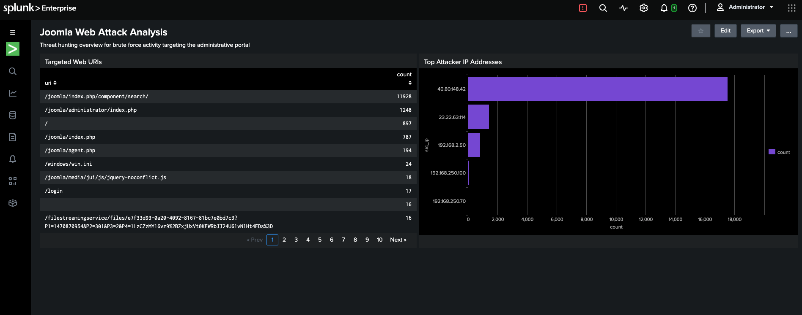

# Splunk-Threat-Hunting-Lab

# Cloud SIEM Engineering & Threat Hunting Lab (Splunk & AWS)

## Executive Summary
This project demonstrates the deployment of an enterprise-grade **Splunk SIEM environment** hosted on an **AWS EC2 Ubuntu Linux instance** within the **London (eu-west-2) region**. 

Using the industry-standard **Splunk BOTS (Boss of the SOC) v1 dataset**, I conducted a proactive threat-hunting investigation to identify, analyze, and map out a malicious external reconnaissance attack targeting a corporate Content Management System (CMS).

---

## 🛠️ Infrastructure & Tech Stack
* **SIEM Platform:** Splunk Enterprise (v9.4.0)
* **Cloud Architecture:** Amazon Web Services (AWS) EC2, Elastic Block Store (EBS)
* **Operating System:** Ubuntu Server 24.04 LTS
* **Query Language:** SPL (Splunk Processing Language)
* **Visualization Configuration:** XML Dashboard Templates

---

## 🕵️‍♂️ Investigation Blueprint & Threat Analysis

### 1. Attacker Identification (Reconnaissance Phase)
To isolate the external threat actor conducting automated network scanning, I analyzed raw HTTP stream data ingested into the `botsv1` index. 

**SPL Query:**
```spl
index=botsv1 sourcetype=stream:http
| stats count by src_ip
| sort - count
```

**Findings:** 
A single malicious external IP address **`40.80.148.4`** generated thousands of rapid, automated web requests, heavily outnumbering legitimate corporate network traffic. 

### 2. Attack Vector Isolation (Directory Enumeration)
After identifying the threat actor's IP, I isolated their traffic to determine what specific assets they were targeting on the public-facing web server.

**SPL Query:**
```spl
index=botsv1 sourcetype=stream:http
| stats count by uri
| sort - count
```

**Findings:** 
The attacker was running a directory brute-force tool aggressively targeting the administrative portal at **`/joomla/administrator/index.php`**. This indicates an attempt to exploit the CMS authentication layer or brute-force administrative credentials to achieve an initial foothold on the server.

---

## 📊 Visual Security Operations Centre (SOC) Dashboard

I compiled these hunting queries into a visual XML-backed dashboard to assist security teams with real-time monitoring. The raw source code can be reviewed in the `joomla_attack_dashboard.xml` file in this repository.

* **Top Attacker IP Addresses Panel:** Configured as a visual Bar Chart to immediately isolate high-volume request anomalies.
* **Targeted Web URIs Panel:** Configured as a structured data table to log exactly which web endpoints are absorbing brute-force traffic.

---

## 🛡️ Recommended Security Mitigations
Based on the traffic patterns discovered in this investigation, I recommend the following defensive controls:
1. **Network Layer:** Implement strict IP Rate Limiting and deploy a Web Application Firewall (WAF) to automatically block IPs exhibiting automated scanning behaviors.
2. **Identity & Access Management:** Enforce mandatory Multi-Factor Authentication (MFA) on the `/joomla/administrator/` path and restrict access to the portal behind a corporate VPN or Zero Trust Network Access (ZTNA) gateway.
3. **Monitoring:** Configure proactive Splunk Alert Actions to trigger real-time alerts whenever a single external source IP exceeds 100 requests to administrative paths within a 60-second window.
